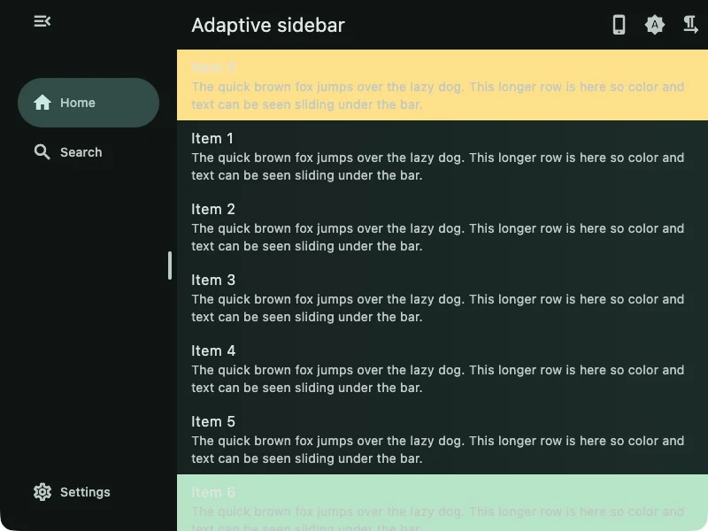
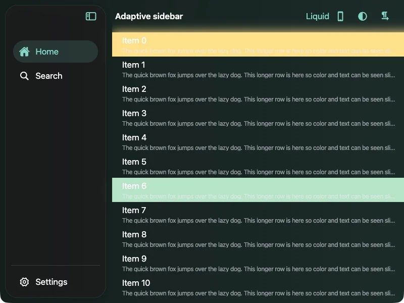
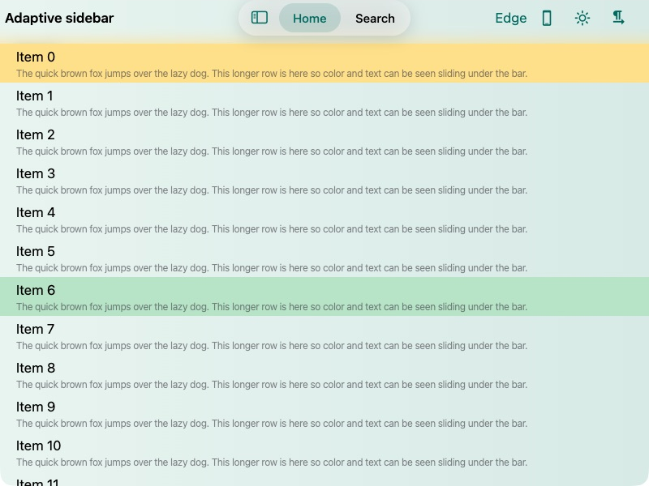

<!-- markdownlint-disable MD013 MD033 MD060 -->

# flutter_adaptive_sidebar

![Package][pubdev-package]
![Likes][pubdev-likes]
![Points][pubdev-points]

[EN](README.md) / 中文

由同一个控制器驱动的 Material 与 Cupertino 侧边栏。

本包负责侧边栏的呈现与状态管理，响应式布局则交给应用控制。你可以自行决定何时显示
侧边栏，以及窗口在什么尺寸下只显示内容区。

## 功能特点

- Material 与 Cupertino 两种侧边栏样式
- 共享选中项、展开状态和宽度状态
- 内置主导航与辅助导航列表
- 支持自定义内容、导航项样式、提示和操作文案
- 支持拖拽调整宽度和可选的 Cupertino 折叠栏
- 支持窗口控件避让和从右到左布局

## 效果展示

| Material                                                        | Cupertino                                                                                                                                                                                         |
| --------------------------------------------------------------- | ------------------------------------------------------------------------------------------------------------------------------------------------------------------------------------------------- |
|  | **标准样式**<br><br><br><details><summary><strong>Edge 样式 · 亮色</strong></summary><br></details> |

## 开始使用

添加依赖：

```shell
flutter pub add flutter_adaptive_sidebar
```

两种侧边栏可以共用同一个控制器，`content` 参数可接收任意组件。如果需要现成的
导航列表，可以使用 `MaterialSidebarNavigation` 或
`CupertinoSidebarNavigation`；两者都支持固定在底部的导航项。它们对应的行组件
分别是 `MaterialWideNavigationRailButton` 和 `CupertinoSidebarDestination`。

```dart
final Widget page = AnimatedBuilder(
  animation: controller,
  builder: (context, _) => useMaterial
      ? Row(
          children: [
            MaterialSidebar(
              controller: controller,
              content: MaterialSidebarNavigation(
                destinations: destinations,
                selection: controller.selection,
                onSelectionChanged: controller.select,
              ),
            ),
            Expanded(child: body),
          ],
        )
      : CupertinoSidebar(
          controller: controller,
          content: CupertinoSidebarNavigation(
            destinations: destinations,
            selection: controller.selection,
            onSelectionChanged: controller.select,
          ),
          child: body,
        ),
);
```

通过控制器选择导航项或切换侧边栏：

```dart
controller.select(const SidebarPrimarySelection(0));
controller.toggleExpanded();
```

不再使用控制器时，请调用 `dispose()`。响应式布局和其他配置可参考
[示例应用](example/lib/main.dart)。

`CupertinoSidebar.edge` 默认使用按 iPadOS 27 Sidebar 调整的中性亮色/暗色填充。
可通过 `backgroundColor` 传入普通 `Color` 或 `CupertinoDynamicColor` 覆盖表面颜色；
透明颜色会保留背景模糊效果。

## 更多示例

<details>
<summary><strong>运行示例应用</strong></summary>

```shell
cd example
fvm flutter run
```

示例应用包含响应式布局、Material 与 Cupertino 样式、自定义导航内容、折叠栏和
窗口控件避让。

</details>

## 开发

<details>
<summary><strong>本地检查</strong></summary>

```shell
# Format, analyze, and test the package and example application.
make check
```

</details>

## 捐赠

[!["Buy Me A Coffee"][buymeacoffee-badge]](https://www.buymeacoffee.com/d49cb87qgww)
[![Alipay][alipay-badge]][alipay-addr]
[![WechatPay][wechat-badge]][wechat-addr]

[![ETH][eth-badge]][eth-addr]
[![BTC][btc-badge]][btc-addr]

## 许可证

本项目基于 MIT License 许可。
完整许可文本见 [LICENSE](LICENSE)。

```text
MIT License

Copyright (c) 2026 Fries_I23

Permission is hereby granted, free of charge, to any person obtaining a copy
of this software and associated documentation files (the "Software"), to deal
in the Software without restriction, including without limitation the rights
to use, copy, modify, merge, publish, distribute, sublicense, and/or sell
copies of the Software, and to permit persons to whom the Software is
furnished to do so, subject to the following conditions:

The above copyright notice and this permission notice shall be included in all
copies or substantial portions of the Software.

THE SOFTWARE IS PROVIDED "AS IS", WITHOUT WARRANTY OF ANY KIND, EXPRESS OR
IMPLIED, INCLUDING BUT NOT LIMITED TO THE WARRANTIES OF MERCHANTABILITY,
FITNESS FOR A PARTICULAR PURPOSE AND NONINFRINGEMENT. IN NO EVENT SHALL THE
AUTHORS OR COPYRIGHT HOLDERS BE LIABLE FOR ANY CLAIM, DAMAGES OR OTHER
LIABILITY, WHETHER IN AN ACTION OF CONTRACT, TORT OR OTHERWISE, ARISING FROM,
OUT OF OR IN CONNECTION WITH THE SOFTWARE OR THE USE OR OTHER DEALINGS IN THE
SOFTWARE.
```

[pubdev-package]: https://img.shields.io/pub/v/flutter_adaptive_sidebar.svg
[pubdev-likes]: https://img.shields.io/pub/likes/flutter_adaptive_sidebar?logo=dart
[pubdev-points]: https://img.shields.io/pub/points/flutter_adaptive_sidebar?logo=dart
[buymeacoffee-badge]: https://img.shields.io/badge/Buy_Me_A_Coffee-FFDD00?style=for-the-badge&logo=buy-me-a-coffee&logoColor=black
[alipay-badge]: https://img.shields.io/badge/alipay-00A1E9?style=for-the-badge&logo=alipay&logoColor=white
[alipay-addr]: https://raw.githubusercontent.com/FriesI23/mhabit/main/docs/README/images/donate-alipay.jpg
[wechat-badge]: https://img.shields.io/badge/WeChat-07C160?style=for-the-badge&logo=wechat&logoColor=white
[wechat-addr]: https://raw.githubusercontent.com/FriesI23/mhabit/main/docs/README/images/donate-wechatpay.png
[eth-badge]: https://img.shields.io/badge/Ethereum-3C3C3D?style=for-the-badge&logo=Ethereum&logoColor=white
[eth-addr]: https://etherscan.io/address/0x35FC877Ef0234FbeABc51ad7fC64D9c1bE161f8F
[btc-badge]: https://img.shields.io/badge/Bitcoin-000000?style=for-the-badge&logo=bitcoin&logoColor=white
[btc-addr]: https://blockchair.com/bitcoin/address/bc1qz2vjews2fcscmvmcm5ctv47mj6236x9p26zk49
